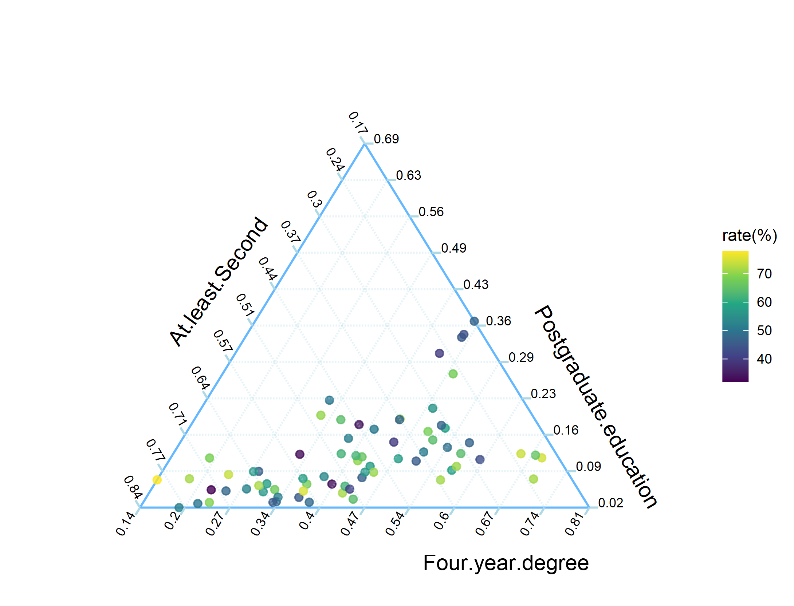
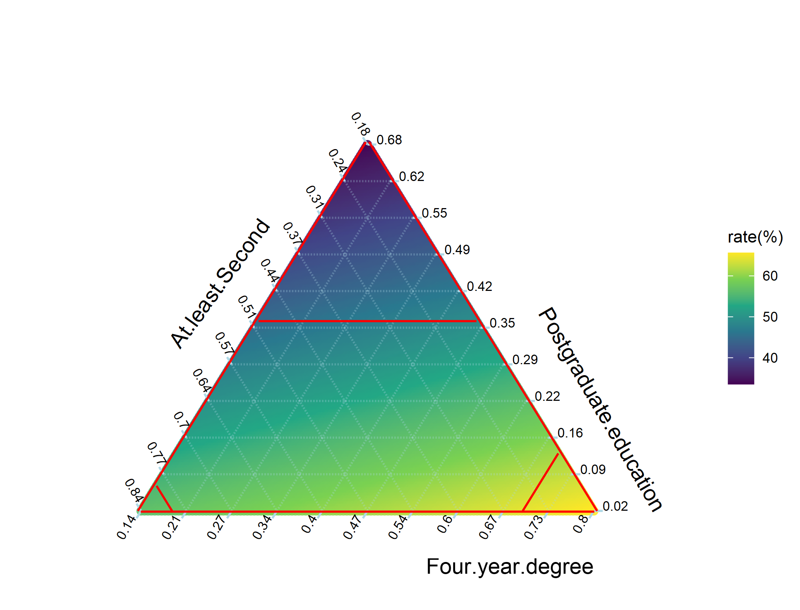

# Application on WHOdataset

## Data description

During the COVID-19 pandemic, a widely discussed question was whether educational attainment influenced people's hesitancy about vaccine side effects. To investigate this relationship, we used data from the **2021 WHO Health Inequality Data Repository**, which reports the proportion of individuals at different education levels for each country. Since these values represent population shares, we treated them as compositional data and focused on three representative categories: at least secondary education, a four-year degree, and postgraduate education.

To incorporate the potential role of institutional trust, we also included two variables from the **World Happiness Report (2021)**: institutional trust and perceptions of corruption. Earlier studies have suggested that institutional trust plays an important role in shaping public responses to vaccination campaigns, and these variables help capture that dimension.

After merging these sources, the final dataset contains 72 countries, each described by compositional educational indicators and trust-related covariates. The response variable is the proportion of unvaccinated individuals who reported concerns about side effects.

To explore possible nonlinear relationships between education compositions and concerns about side effects, we visualize the data and model fits in the figure below. Prior simulation studies showed that the local linear Dirichlet (LLD) estimator performs particularly well when compositional observations lie near the boundary of the simplex. As seen in the observed data, the proportion corresponding to postgraduate education is relatively small (approximately 0.02–0.09), indicating that many observations lie close to the boundary. Motivated by this feature, we adopt the LLD method for the subsequent analysis.

```r
library(doParallel)
library(ggplot2)
library(viridis)
source(""https://raw.githubusercontent.com/Zhiyu-Wei/simplex-kernel-regression/R/application.R")
url <- "https://raw.githubusercontent.com/Zhiyu-Wei/simplex-kernel-regression/example/WHOdataset.csv"
ds <- read.csv(url)
obj=ds[,3]
data1=ds[,c(10,19)]
data2=as.matrix(ds[,c(6,7,8)])
finaldata <- cbind(obj,data2,data1)
colnames(finaldata)=c("y","x1","x2","x3","z1","z2")
n <- nrow(finaldata)
draw_composition_plot(data2,obj,boundary.color="red",original.data=data2)
```

<p align="center">
  
  <br>
  <em>Figure 1: Observed data.</em>
</p>

The bandwidth parameter $h$ was selected using the leave-one-out cross-validation criterion,

$$
\hat{h} = \arg\min_{h \in (0,\infty)} \mathrm{CV}(h),
$$

which yielded an optimal value of approximately $\hat{h} = 0.0786$ when the Dirichlet kernel was used with tuning parameter $a = 0$. The choice of $a = 0$ is motivated by empirical performance: for this dataset, the estimator with $a = 0$ yields a smaller MSE compared to $a = 1$, and it also leads to more statistically decisive results in the subsequent model selection analysis.  

The figure below shows the graph of $CV(h)$ as a function of the bandwidth $h$.

<p align="center">
  
  <br>
  <em>Figure 2: Plot of the leave-one-out cross-validation as a function of the bandwidth $h$.</em>
</p>

Then, using this selected bandwidth $\hat{h}$, we applied the LLD estimator on the simplex to visualize the fitted relationship and compared its performance with that of the linear model.

```r
#LLDK
composition_LL_kernel_smoother(data2,obj,0.005,h,original.data=data2,boundary.color="red")
#linear model
resolution<-0.005
Lmin <- min(data2[,1])
Rmin <- min(data2[,2])
Tmin <- min(data2[,3])

grid_points <- expand.grid(
  x = seq(0, 1, by = resolution),
  y = seq(0, 1, by = resolution)
)
grid_points$z <- 1 - grid_points$x - grid_points$y

grid_points <- subset(grid_points,x > Lmin & x < 1-Rmin-Tmin&y > Rmin & y < 1-Lmin-Tmin&z > Tmin & z < 1-Lmin-Rmin)
colnames(grid_points)<-c("x1","x2","x3")

model <- lm(y~x1+x2+x3,data=finaldata)

pred.lm <- predict(model,newdata=grid_points)
colnames(grid_points)<-colnames(data2)
draw_composition_plot(grid_points,pred.lm,boundary.color="red",original.data=data2,show_boundary = TRUE)
```

<p align="center">
  
  
  <br>
  <em>
    Figure 3: (Left) presents the fitted surface from Dirichlet kernel regression, capturing potential nonlinear
structures. (Right) shows the fitted surface from linear regression, which fails to capture the underlying structure
observed in the data.
  </em>
</p>

## Model selection
To formally evaluate whether nonlinear modeling improves the explanatory performance on real data, we performed pairwise model comparisons using the bootstrap likelihood ratio test (BLRT). This procedure tests whether including linear or kernel-smoothed compositional terms significantly enhances model fit relative to simpler alternatives.


```r
#M1 vs M2
model.1 <- lm(y ~ z1 + z2, data = finaldata)
#summary(model.1)
#deviance(model.1)
model.2 <- lm(y ~ z1 + z2+ x1 + x2 + x3 - 1, data = finaldata)
#summary(model.2)
#deviance(model.2)
lrt_result <- anova(model.1, model.2, test = "LRT")
p.m1m2<-lrt_result$`Pr(>Chi)`[2]
#M1 vs M3
X_kern_train <- as.matrix(data2[, 1:3])   # x1,x2,x3
X_loc_train  <- as.matrix(data2[, 1:2])   # x1,x2
Sij          <- build_S_locallinear_dirichlet(      # in-sample S (如果你有前面的版本)
  X_kern = X_kern_train,
  X_loc  = X_loc_train,
  alpha  = alp,
  h      = h
)
n=nrow(finaldata)
Sij <-Sij_LL
I <- diag(n)
Wmatrix <- model.matrix(~ z1 + z2 -1, data = finaldata)
#Model 3 fit (semi-parametric)
Betahat <- solve(t(Wmatrix) %*% (I - Sij) %*% Wmatrix) %*% t(Wmatrix) %*% (I - Sij) %*% obj
Muhat <- Sij %*% (obj - Wmatrix %*% Betahat)
pred.obj <- Wmatrix %*% Betahat + Muhat
RSS_1_M3 <- sum((obj - pred.obj)^2)

B=1000
nCores <- detectCores() - 8
cl <- makeCluster(nCores)
registerDoParallel(cl)

lambda_obs_M1M3 <- n * log(deviance(model.1) / RSS_1_M3)
res.1 <- residuals(model.1)
pred.1 <- fitted(model.1)
lambda_boot <- foreach(b = 1:B, .combine = c,.packages = "MASS") %dopar% {
  y.star <- pred.1 + sample(res.1, n, replace = TRUE)
  RSS_0 <- deviance(lm(y.star ~ z1 + z2, data = finaldata))
  Betahat <- solve(t(Wmatrix) %*% (I - Sij) %*% Wmatrix) %*% t(Wmatrix) %*% (I - Sij) %*% y.star
  Muhat <- Sij %*% (y.star - Wmatrix %*% Betahat)
  pred.y <- Wmatrix %*% Betahat + Muhat
  RSS_1 <- sum((y.star - pred.y)^2)
  n * log(RSS_0 / RSS_1)
}
p.m1m3 <- (1 + sum(lambda_boot >= lambda_obs_M1M3)) / (B + 1)

#M2 vs M3
lambda_obs_M2M3 <- n * log(deviance(model.2) / RSS_1_M3)
res.1 <- residuals(model.2)
pred.1 <- fitted(model.2)
lambda_boot <- foreach(b = 1:B, .combine = c,.packages ="MASS") %dopar% {
  y.star <- pred.1 + sample(res.1, n, replace = TRUE)
  RSS_0 <- deviance(lm(y.star ~ z1 + z2+ x1 + x2 + x3 - 1, data = finaldata))
  Betahat <- solve(t(Wmatrix) %*% (I - Sij) %*% Wmatrix) %*% t(Wmatrix) %*% (I - Sij) %*% y.star
  Muhat <- Sij %*% (y.star - Wmatrix %*% Betahat)
  pred.y <- Wmatrix %*% Betahat + Muhat
  RSS_1 <- sum((y.star - pred.y)^2)
  n * log(RSS_0 / RSS_1)
}
p.m2m3 <- (1 + sum(lambda_boot >= lambda_obs_M2M3)) / (B + 1)

stopCluster(cl)
print(c(p.m1m2,p.m1m3,p.m2m3))
```
**Table1** presents the BLRT results for three nested models. While adding linear compositional covariates **W1** vs **W2** does not yield a significant improvement, incorporating a nonparametric component **W3** leads to a significantly better fit when compared to both **W1** and **W2**.

<p align="center">
<strong>Table 1. BLRT results for model selection on real data.</strong> 
</p>

<table align="center">
  <tr>
    <th>Reduced Model</th>
    <th>Full Model</th>
    <th>p-value</th>
    <th>Reject H<sub>0</sub></th>
  </tr>
  <tr>
    <td><strong>W1</strong></td>
    <td><strong>W2</strong></td>
    <td>0.232</td>
    <td>No</td>
  </tr>
  <tr>
    <td><strong>W1</strong></td>
    <td><strong>W3</strong></td>
    <td>0.026</td>
    <td>Yes</td>
  </tr>
  <tr>
    <td><strong>W2</strong></td>
    <td><strong>W3</strong></td>
    <td>0.012</td>
    <td>Yes</td>
  </tr>
</table>

Based on these results, we selected **W3** as the final specification. As a partial linear model, **W3** combines kernel-smoothed effects for compositional covariates with linear trust variables, offering a flexible yet interpretable framework for modeling the data structure.

## Analysis and Interpretation

Having selected the partial linear model **W3** as the best-fitting specification, we now examine its components to interpret the effects of both institutional trust and educational composition on vaccine side effect concerns.

This model includes two parts: a linear component for trust-related covariates, and a nonparametric surface for the compositional education variables estimated via LLD regression. We present the estimated coefficients for the linear terms and visualize the fitted residual surface to gain insight into the nonlinear structure associated with education levels.

### Linear Component: Institutional Trust

**Table2** presents the estimated coefficients for the linear covariates in the partial linear model. Although both institutional trust and perceived corruption show negative associations with concern about side effects, neither effect reaches statistical significance at the 5% level. This suggests that, after accounting for nonlinear variation due to educational composition, the direct linear influence of trust-related variables on concern about vaccine side effects is limited in this dataset.

```r
Wmatrix <- model.matrix(~ z1 + z2 -1, data = finaldata)
I <- diag(n)
Betahat <- solve(t(Wmatrix) %*% (I - Sij) %*% Wmatrix) %*%
  t(Wmatrix) %*% (I - Sij) %*% obj
Muhat   <- Sij %*% (obj - Wmatrix %*% Betahat)

pred.obj <- Wmatrix %*% Betahat + Muhat
RSS_1_M3 <- sum((obj - pred.obj)^2)

# Step 1: Effective degrees of freedom for kernel part
edf_m <- sum(diag(Sij))  # trace(S)

# Step 2: Estimate sigma^2
p <- ncol(Wmatrix)
sigma2_hat <- RSS_1_M3 / (n - edf_m - p)

# Step 3: Variance-covariance matrix of Betahat
Var_Beta <- sigma2_hat * solve(t(Wmatrix) %*% (I - Sij) %*% Wmatrix)

# Step 4: Standard errors
SE_Beta <- sqrt(diag(Var_Beta))

Coef = as.vector(Betahat)
SE = sqrt(diag(Var_Beta))
df = n - edf_m - length(Coef)

t_stat = Coef / SE
p_value = 2 * (1 - pt(abs(t_stat), df))

result <- data.frame(
  Estimate = round(Coef,3),
  Std.Error = round(SE,3),
  t.value = round(t_stat,3),
  p.value = round(p_value,3)
)
#linear covariate
print(result)
```
<p align="center">
<strong>Table 2. Estimated coefficients, standard errors, and p-values for the linear
component in the partial linear model (M3).</strong>
</p>

<table align="center">
  <thead>
    <tr>
      <th>Covariate</th>
      <th>Estimate</th>
      <th>Std. Error</th>
      <th>t value</th>
      <th>p-value</th>
    </tr>
  </thead>
  <tbody>
    <tr>
      <td>Institutional Trust</td>
      <td align="center">-13.146</td>
      <td align="center">11.857</td>
      <td align="center">-1.109</td>
      <td align="center">0.272</td>
    </tr>
    <tr>
      <td>Perceived Corruption</td>
      <td align="center">-5.870</td>
      <td align="center">10.191</td>
      <td align="center">-0.567</td>
      <td align="center">0.567</td>
    </tr>
  </tbody>
</table>

### Nonparametric Component: Educational Composition

To visualize the nonlinear contribution of educational composition, we plot the estimated function $m(x)$ over the simplex using a ternary diagram in **Figure4**. This surface represents the residual effect of compositional covariates on concern about vaccine side effects, after controlling for institutional trust via the linear component.

Each point on the simplex corresponds to a particular distribution of educational attainment across three levels: secondary, four-year degree, and postgraduate. The color scale indicates the magnitude of the estimated effect at each composition, with higher values reflecting stronger concern unexplained by trust variables.

<p align="center">
  
  <br>
  <em>Figure 4: Estimated kernel-smoothed surface $m(x)$ over the educational composition simplex. The surface reflects variation in vaccine side effect concern unexplained by institutional trust. Color intensity indicates the magnitude of the estimated effect at each composition.</em>
</p>
